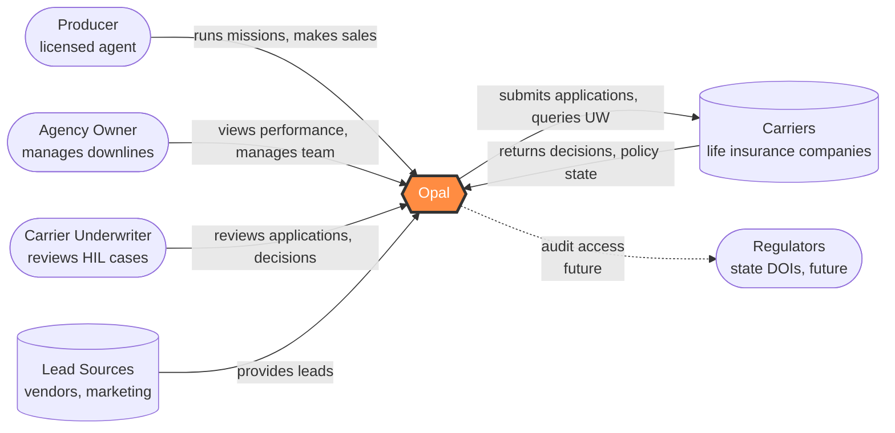
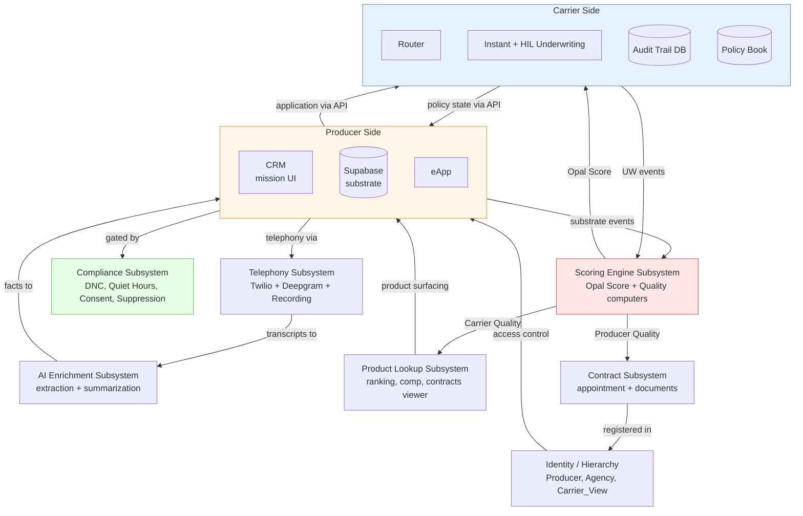
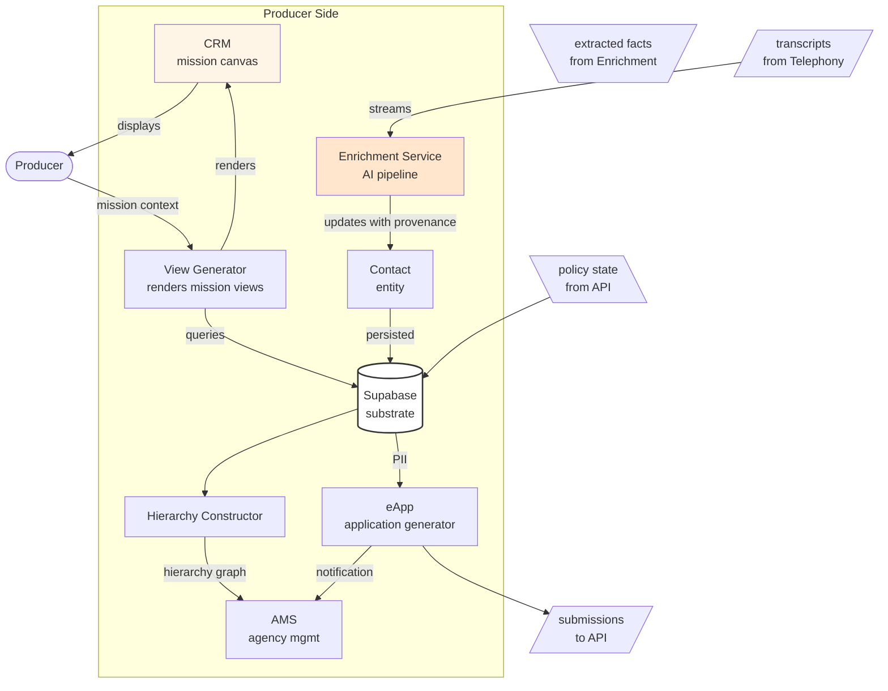
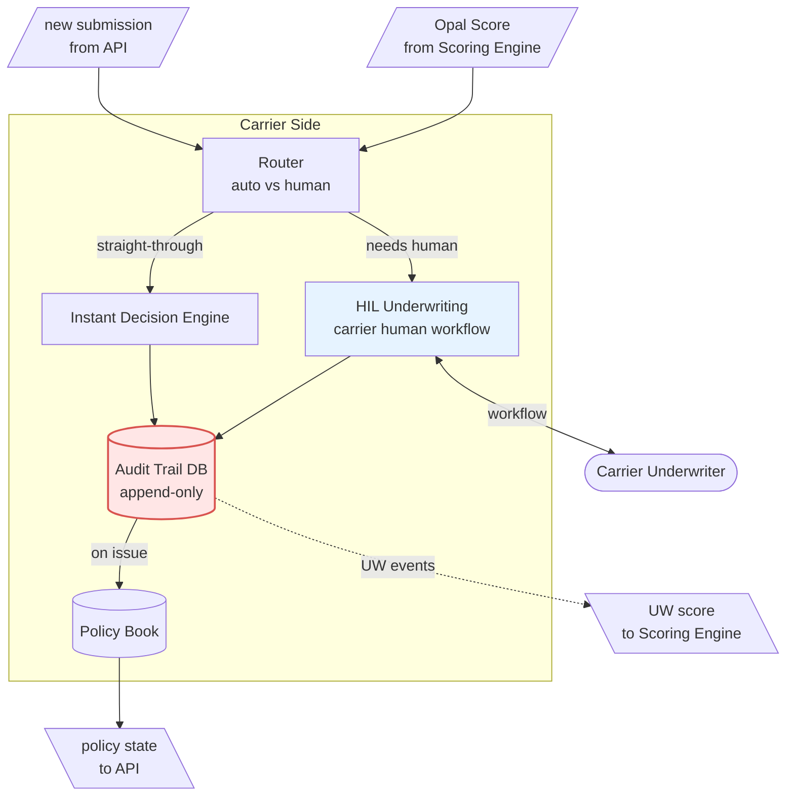
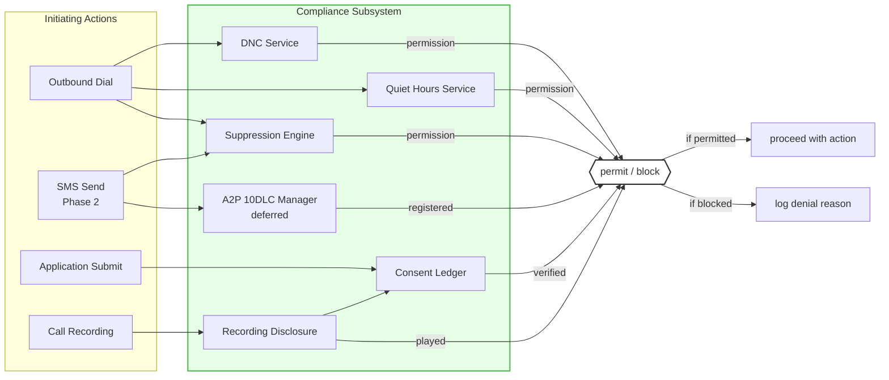
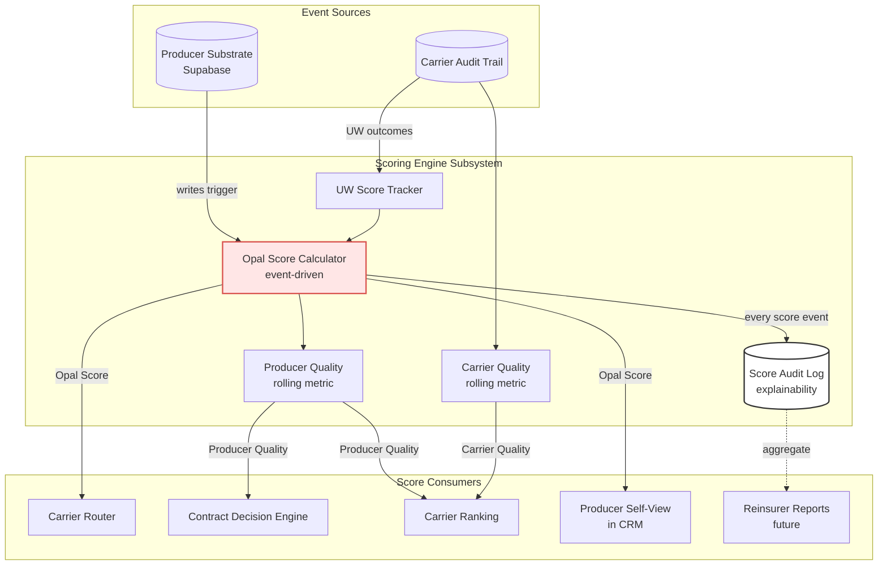
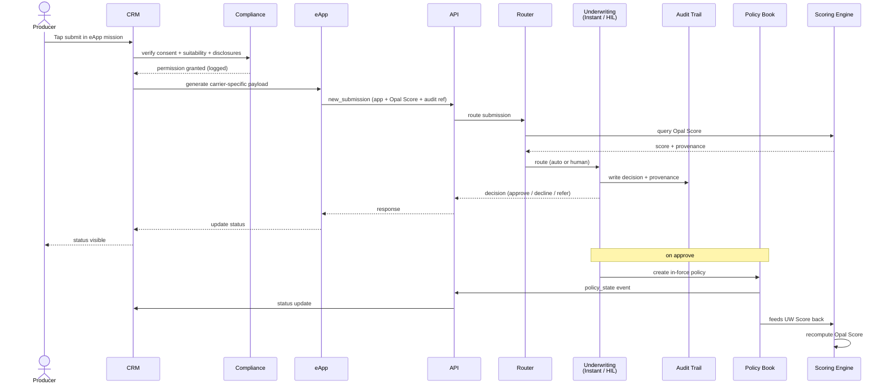
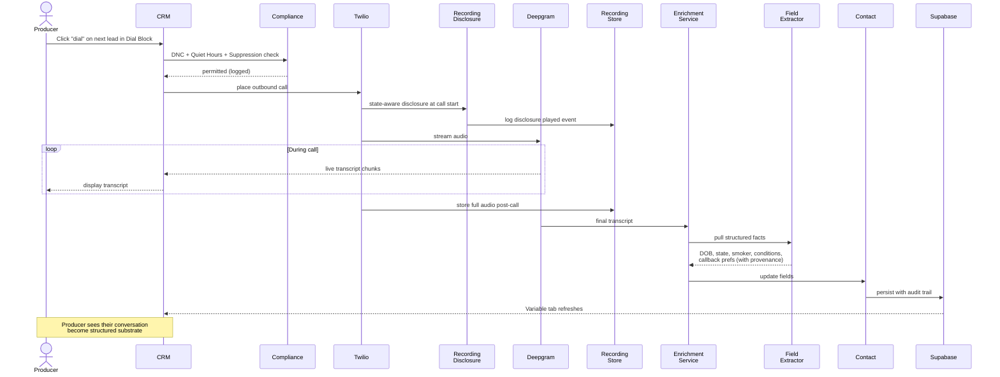

# Opal Architecture — Mermaid Visualizations v1

Generated from `opal_architecture_model.md`. Each diagram is scoped to one audience or conversation. Edit by editing the Mermaid source — these render in GitHub, Notion, most markdown viewers, and Claude artifacts.

---

## 1. System Context — who interacts with Opal

For non-technical audiences (investors, carriers in first conversations, advisors). Shows Opal as a black box with the actors and external systems around it.

---

## 2. Subsystem Overview — the 9 subsystems and primary flows

For engineering and architecture conversations. Each subsystem is a single node; cross-cutting flows shown with labels.

---

## 3. Producer Side — internal components

For engineering team and UX conversations. Shows what lives inside the Producer Side subsystem.

---

## 4. Carrier Side — internal components

For carrier compliance and integration conversations. Shows what runs on the carrier-facing pipeline.

---

## 5. Compliance gate pattern — cross-cutting enforcement

For compliance, legal, and carrier security conversations. Shows that every regulated action passes through a gate.

---

## 6. Scoring Engine — how scores propagate

For investor conversations about the moat, and carrier conversations about producer quality.

---

## 7. Application submission — end-to-end sequence

For engineering and carrier integration conversations. Shows the full path from operator submit to in-force policy.

---

## 8. Call → transcript → substrate — the magical capability

For demos and engineering. Shows how a producer's call becomes structured substrate facts.

---

## Notes on visualization choices

- **Color coding**: orange = producer side, blue = carrier side, red = scoring (the moat), green = compliance (the gate). Consistent across diagrams.
- **Shape coding**: `([rounded])` = persons/actors, `[(cylinder)]` = data stores, `[rectangle]` = services, `{{hexagon}}` = the whole system, `{diamond}` = decision points.
- **Dotted arrows** mean future / deferred, not implemented yet.
- **Sequence diagrams** for flows that need temporal ordering (submission, call processing).
- **Flowcharts** for everything else.

## When to use which diagram

| Diagram | Audience |
|---|---|
| 1. System Context | Investors, first-call carriers, advisors |
| 2. Subsystem Overview | Engineering hires, architecture deep-dives |
| 3. Producer Side detail | UX designers, frontend engineering |
| 4. Carrier Side detail | Carrier compliance/integration teams |
| 5. Compliance gate | Carrier compliance, legal, E&O conversations |
| 6. Scoring Engine | Investor moat conversations, carrier producer-quality discussions |
| 7. Application sequence | Engineering, carrier integration architects |
| 8. Call-to-substrate sequence | Product demos, "what makes this different" conversations |

For investor decks specifically, take diagram 1 and 6 and redraw them in Figma with proper visual design. These Mermaid versions are correct but not persuasive — the model is the source of truth, the polished visuals are the presentation layer.
